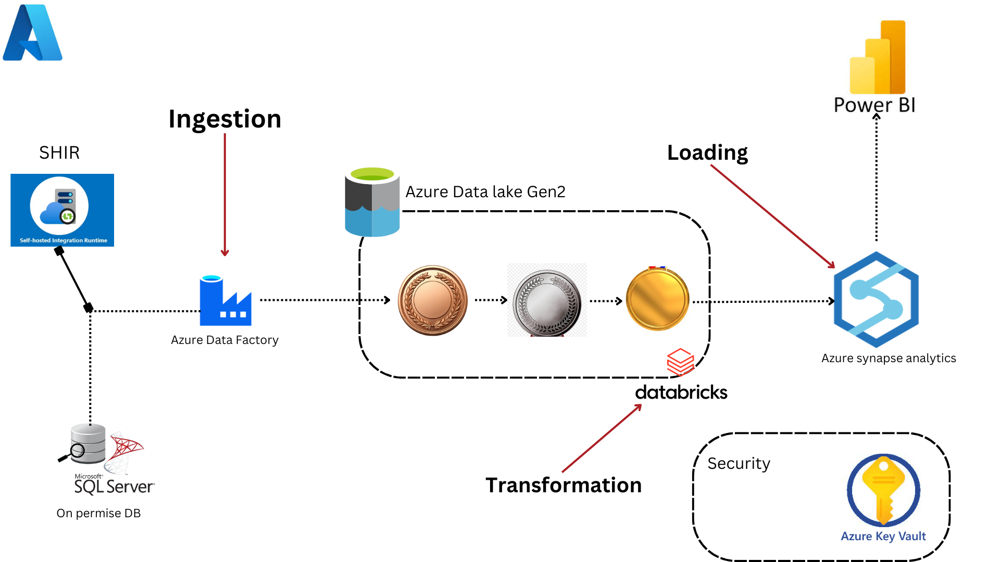

# Data Engineering on Azure
This project showcases a complete data engineering solution on Microsoft Azure, built to manage data ingestion, transformation, and analysis from an on-premises SQL Server database to a full reporting platform in Power BI. The solution integrates Azure Data Lake Storage Gen2, Azure Data Factory, Azure Databricks, and Azure Synapse Analytics, with security protocols managed through Azure Key Vault.

# Project Overview
## Pipeline Components
&nbsp;&nbsp;&nbsp;&nbsp;&nbsp;**1. Self-Hosted Integration Runtime (SHIR):** 

        • Utilized to ensure secure data transfer from the on-premises SQL Server to Azure, the Self-Hosted Integration Runtime (SHIR) enables 
          connectivity between the on-premises environment and Azure Data Factory.

&nbsp;&nbsp;&nbsp;&nbsp;&nbsp;**2. Azure Data Factory (ADF):**

        • Manages the data pipeline by transferring data from the on-premises SQL Server to Azure Data Lake Storage Gen2 through the Self-Hosted 
          Integration Runtime (SHIR).
        • Conducts data ingestion and employs a variety of activities to oversee data flow, ensuring smooth execution of the pipeline.

&nbsp;&nbsp;&nbsp;&nbsp;&nbsp;**3. Azure Data Lake Storage Gen2:**

        • Organizes ingested data into Bronze, Silver, and Gold layers to effectively handle raw, cleaned, and curated datasets.

&nbsp;&nbsp;&nbsp;&nbsp;&nbsp;**4. Azure Databricks**

        • Facilitates the transformation of data from the Silver layer to the Gold layer.
        • Manages intricate data transformations, cleansing, and preparation for subsequent analytics processes.
        
&nbsp;&nbsp;&nbsp;&nbsp;&nbsp;**5. Azure Synapse Analytics:**

        • Functions as the data warehouse, integrating curated data from the Gold layer to support advanced analytics.
        • Supports efficient query execution and provides the data source for Power BI reports.
        
&nbsp;&nbsp;&nbsp;&nbsp;&nbsp;**6. Azure Key Vault:**

        • Safeguards and manages sensitive data, including database connection strings and API keys utilized across the pipeline.
        
&nbsp;&nbsp;&nbsp;&nbsp;&nbsp;**7. Power BI:**

        • Integrates with Azure Synapse Analytics to facilitate data visualization and reporting, providing insights and analysis of the ingested and 
          processed data.

